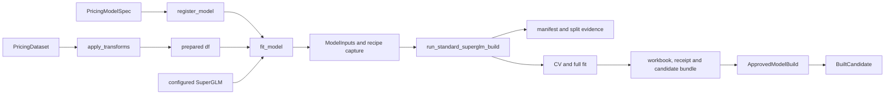
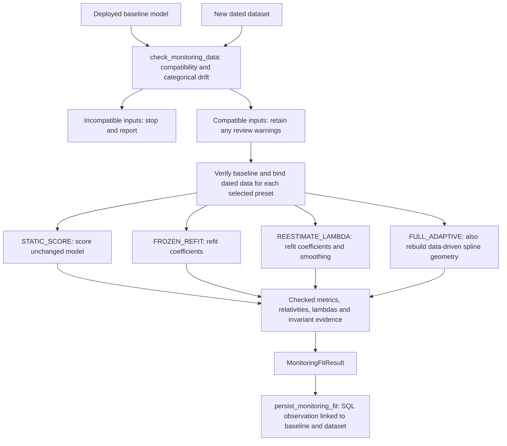

# How the package fits together

Start with `pricing_pipeline.notebook` for model work and
`pricing_pipeline.reporting` for reports. The packages underneath implement
those entry points. An internal function being importable does not make it
an analyst API.

For notebook generation, use the [argument-to-cell trace](scaffold-trace.md).
For individual files, use the [module index](module-index.md).

## The objects passed between steps

| Object | Produced by | Consumed by | Meaning |
|---|---|---|---|
| `PricingDataset` | Ingestion code or `PricingDataset.load` | `PricingModelSpec`, recipe `build`, data preparation | A dataframe snapshot with source, row keys and an as-at column. |
| `PricingModelSpec` | Analyst Python or recipe `build` | `register_model`, then `fit_model` through its registered reference | Column roles, transforms, validation and fit/export choices. |
| `RegisteredModel` | `register_model` or `load_registered_model` | Fit, lookup and deployment helpers | SQL identity and source directory. A lookup-only reference has no fitting spec. |
| `ModelInputs` | `fit_model` | `run_standard_superglm_build` | Aligned X, y, weights, offset and row keys. Internal to the training path. |
| `ApprovedModelBuild` | Standard builder or edit publication preparation | Publication validation and database writer | Immutable IDs, metrics and artifact hashes. The name does not imply deployment approval. |
| `BuiltCandidate` | `fit_model` | `save_model_version` | The registered reference plus completed-build evidence before package publication. |
| `CompletedModelPublishResult` | `save_model_version` or edit publication | Notebook display and later package selection | Saved SQL package/run identity and recipe revision. |
| `Candidate` | `load_model_version` | Editor, manual adjustment and deployment | A saved package with verified artifacts and the deployment snapshot reviewed with it. |
| `ModelRecipe` | `candidate.recipe`, `from_model` or `load` | TOML `save` or `build(dataset=...)` | Reusable declared configuration, excluding learned fit state. |

The similar names above are a discovery problem. In particular, `BuiltCandidate`
and `Candidate` refer to different stages, while `PricingModelSpec` and
`ApprovedModelBuild` refer to choices and completed evidence respectively.
Their class docstrings state these differences so IDE hover and `help()` can
explain them without a trip to this page.

## From data to a completed fit



| Handoff | Where to read | What to check |
|---|---|---|
| Source column to prepared column | [`data.transforms.apply_transforms`](../src/pricing_pipeline/data/transforms.py) | Mapping keys name outputs; transform objects name sources. |
| Analyst choices to validated spec | [`models.pricing.PricingModelSpec`](../src/pricing_pipeline/models/pricing.py) | Validate column roles, transforms, CV and fit choices. The existing notebook import points to this class. |
| Prepared column to model role | [`notebook.fit_model`](../src/pricing_pipeline/notebook.py) | `spec.features` selects X; `target` selects y; weight and offset fields select their vectors. |
| Dataset to reproducible splits | [`data.manifest`](../src/pricing_pipeline/data/manifest.py) | Frame identity, ordered row keys, split positions and recorded SQL references. |
| Declared estimator to recipe | [`modeling.recipes.ModelRecipe.from_model`](../src/pricing_pipeline/modeling/recipes/__init__.py) | Capture constructor choices before CV/full fitting changes model state. |
| Inputs to fit outputs | [`modeling.standard_superglm.run_standard_superglm_build`](../src/pricing_pipeline/modeling/standard_superglm.py) | Validation, manifest creation, CV, full fit, export and final evidence record. |
| Fitted estimator to workbook metadata | [`publishing.metadata`](../src/pricing_pipeline/publishing/metadata.py), [`publishing.rating_tables`](../src/pricing_pipeline/publishing/rating_tables.py) | The receipt explains how exported term values relate to fitted features and transforms. |

Fitting already writes audit records and local files. Saving the rating package
is the next step. A fit is not a read-only preview.

For frozen or adaptive comparisons against a deployed model, follow
[From a baseline to monitoring evidence](#from-a-baseline-to-monitoring-evidence).
Those comparisons use the saved fitted model and its contract.

## From a completed fit to SQL

`notebook.save_model_version` selects the local or remote path:

```text
local:
  publishing.sqlite.publish_sqlite_candidate
  -> PublicationRequest
  -> publishing.publish.publish_candidate
  -> publishing.sqlite.publish_sqlite

remote:
  orchestration.publish_completed_build.publish_completed_model_build
  -> verify candidate artifact against SQL manifest/split lineage
  -> orchestration.pipeline.publish_model_export
  -> PublicationRequest
  -> publishing.publish.publish_candidate
  -> publishing.sqlserver.publish_sqlserver
```

The common publisher checks files and prepares `RatingTables`. Each database
writer resolves retries under its transaction locks, verifies recipe evidence,
and saves the package and run lineage. SQL Server also verifies stored prediction
parity before marking the draft published. Recipe allocation belongs to
[`publishing.recipes`](../src/pricing_pipeline/publishing/recipes.py).

The result is a saved package. [`publishing.deployment`](../src/pricing_pipeline/publishing/deployment.py)
changes which package is active when `deploy_model_version` is called with a
reviewed candidate. Read the writer and deployment code separately when tracing
why a saved model is not the deployed model.

## From a saved version to an edited child

```text
load_model_version
-> Workbench.open: SQL package and lineage lookup
-> load_candidate_bundle: verify and deserialize fitted-model evidence
-> Candidate
-> analyst EditorSession or ManualAdjustmentPolicy
-> notebook.publish_edits / publish_manual_adjustment
-> workbench.submission.save_editor_submission
-> publishing.editor.publish_editor_submission
-> verify submission, reload parent and replay changes
-> PublicationRequest and common publication path
```

[`workbench.core`](../src/pricing_pipeline/workbench/core.py) owns lookup;
[`workbench.artifacts`](../src/pricing_pipeline/workbench/artifacts.py) owns model
files; [`workbench.submission`](../src/pricing_pipeline/workbench/submission.py)
owns proposed edit files. [`publishing.editor`](../src/pricing_pipeline/publishing/editor.py)
coordinates the checks before saving a child package:

| Stage | Owner | Result |
|---|---|---|
| Verify an exact retry or equivalent publication | [`editor_retry`](../src/pricing_pipeline/publishing/editor_retry.py) | A checked existing publication, or continue with a new one. |
| Load trusted parent evidence | [`editor_parent`](../src/pricing_pipeline/publishing/editor_parent.py) | `ParentCandidate`, including verified data and model artifacts. |
| Replay proposed changes | [`editor_replay`](../src/pricing_pipeline/publishing/editor_replay.py) | An edited model checked against the submission and manual policy. |
| Export the child | [`editor_export`](../src/pricing_pipeline/publishing/editor_export.py) | `EditorExport` containing completed-build evidence. |
| Publish and clean up attempts | [`editor`](../src/pricing_pipeline/publishing/editor.py) | `PublicationRequest` into the common publisher, then `EditorPublicationResult`. |

The records live in [`editor_contracts`](../src/pricing_pipeline/publishing/editor_contracts.py).
This workflow is implemented through notebook helpers; `workbench` is not a separate GUI.

## From a baseline to monitoring evidence

Start with [`workflow.run_monitoring_fit`](../src/pricing_pipeline/modeling/monitoring/workflow.py).
It calls the stages in order; it does not write monitoring rows itself.

Run [`check_monitoring_data`](../src/pricing_pipeline/modeling/monitoring/data_checks.py)
once before the preset loop. Inspect its issues and drift table, then call
`raise_for_errors()`. Invalid inputs and unsupported refits stop the loop. Losing
an entire ordered smooth group blocks; losing one raw member of a surviving
group warns. Constant numeric values and splines with no saved-domain overlap
also block. Partial continuous coverage losses and categorical mix changes warn.
Pass `variant` to check a specific comparison; the default is `FROZEN_REFIT`.
`STATIC_SCORE` requires prediction compatibility, not support for re-estimation.
The reference
comes from the candidate's reverified saved training inputs. Aggregate reports
can be logged with `to_json()`; they are separate from SQL monitoring observations.

These are separate comparisons against the same saved baseline. Each selected
variant starts from that baseline, not from the preceding comparison's refit.



| Preset | Coefficients | Smoothing parameters | Spline knots and boundaries |
|---|---|---|---|
| `STATIC_SCORE` | Keep baseline | Keep baseline | Keep baseline |
| `FROZEN_REFIT` | Refit | Keep baseline fitted values | Keep baseline fitted geometry |
| `REESTIMATE_LAMBDA` | Refit | Re-estimate under the declared lambda policy | Keep baseline fitted geometry |
| `FULL_ADAPTIVE` | Refit | Re-estimate under the declared lambda policy | Rebuild data-driven geometry; keep caller-declared knots and boundaries |

The smoothing comparison also refits coefficients. "Smoothing only" means that
smoothing is the additional freedom compared with `FROZEN_REFIT`. Explicitly
fixed lambda policies remain fixed. All three refit presets use `fit_reml`.

All presets preserve the feature set/order, family/link, categorical levels,
groupings and reference levels, ordered values and specials, spline type and
dimension, and shape constraints. `FULL_ADAPTIVE` does not select new features
or redesign groupings. Changing those choices belongs in the normal fit/save
workflow with a revised model specification or recipe, followed by explicit
deployment if selected. That deployment starts a new baseline comparison epoch.

The declared policy is in
[`MONITORING_VARIANT_POLICIES`](../src/pricing_pipeline/modeling/monitoring/contracts.py).
[`materialize_monitoring_model`](../src/pricing_pipeline/modeling/monitoring/fitting.py)
reconstructs each refit; [`invariants`](../src/pricing_pipeline/modeling/monitoring/invariants.py)
checks its permitted changes. The [notebook guide](notebooks/README.md#baseline-epochs-and-monitoring)
explains baseline epochs. The implementation also rejects unsupported frozen
bases and refits with a group-selection penalty rather than relaxing the contract.

| Stage | Owner | Handoff |
|---|---|---|
| Check snapshot compatibility and categorical drift | [`data_checks`](../src/pricing_pipeline/modeling/monitoring/data_checks.py) | `MonitoringDataCheck` with issues, per-level distributions and distances. |
| Check numeric and ordered spline support | [`support_checks`](../src/pricing_pipeline/modeling/monitoring/support_checks.py) | Findings for constant values, missing smooth groups, boundaries and coverage gaps before REML. |
| Describe the baseline and permitted changes | [`contracts`](../src/pricing_pipeline/modeling/monitoring/contracts.py) | `ModelFitContract`, `MonitoringVariant` and result records. |
| Verify and bind the saved baseline | [`baseline`](../src/pricing_pipeline/modeling/monitoring/baseline.py) | A verified fitted model bound to the checked dataframe. |
| Reconstruct and fit the comparison | [`fitting`](../src/pricing_pipeline/modeling/monitoring/fitting.py) | `materialize_monitoring_model` applies the selected frozen/reestimated policy. |
| Extract terms, lambdas, relativities and metrics | [`evidence`](../src/pricing_pipeline/modeling/monitoring/evidence.py) | Result records and hashes of fitted configuration. |
| Check restrictions and saved evidence | [`invariants`](../src/pricing_pipeline/modeling/monitoring/invariants.py) | Verified invariant evidence attached to `MonitoringFitResult`. |
| Save the observation | [`persistence`](../src/pricing_pipeline/modeling/monitoring/persistence.py) | `persist_monitoring_fit` links the result to its baseline run, deployment and dataset manifest. |

Existing imports from `pricing_pipeline.modeling.monitoring` still work.
Monitoring observations do not allocate deployable packages. The persistence
transaction and its retry handling remain together in one module.

Distribution drift is evidence to investigate, not proof that upstream SQL changed.
Matching labels and matching marginal distributions cannot certify unchanged
feature semantics. The [preflight example](notebooks/README.md)
shows the report before fitting; numeric distribution trends remain a dashboard concern.

## From predictions to an offline report

```text
reporting.build_scored_model_report
-> inputs.normalize_report_inputs -> ValidatedReportInputs
-> evidence.collect_model_evidence -> ModelEvidence per model
-> diagnostics.calculate_diagnostics -> DiagnosticSections
-> report.assemble_report_payload
-> _underwriter_html.render_underwriter_html
-> report.write_report_html -> UnderwriterReportResult
```

[`reporting.inputs`](../src/pricing_pipeline/reporting/inputs.py) aligns the
actuals, predictions and weights. [`reporting.evidence_types`](../src/pricing_pipeline/reporting/evidence_types.py)
defines the objects adapters return. `adapters.superglm` and
`adapters.rating_workbook` translate fitted models or workbooks into those objects.
[`evidence`](../src/pricing_pipeline/reporting/evidence.py) collects and normalizes them;
[`evidence_values`](../src/pricing_pipeline/reporting/evidence_values.py) owns shared
value/context checks, and [`interaction_evidence`](../src/pricing_pipeline/reporting/interaction_evidence.py)
validates interaction grids and support. `diagnostics` and `movement` calculate
aggregates; the HTML module renders them. Existing type imports from `evidence`
remain available.

`build_underwriter_report` is the convenience entry point that creates adapter
requests before calling the scored-report workflow. Reporting writes an HTML
artifact and returns aggregate results; it does not change model publication state.

The copyable report script embeds these modules. When moving a reporting owner,
update the dependency-ordered `SOURCE_MODULES` list in
[`scripts/export_portable_underwriter_report.py`](../scripts/export_portable_underwriter_report.py),
then run that script to regenerate `scripts/portable_underwriter_report.py`.
`tests/test_portable_underwriter_report.py` checks that the copied script runs
without importing the installed package and matches its source modules.

## Follow or change a handoff

Use the called function's signature and return type to follow the next object.
Docstrings should name its producer or consumer when the type name alone is
ambiguous. Pass an existing record through when it already represents the input:
the scaffold service passes `ResolvedScaffoldOptions` directly to the renderer.
Keep conversions explicit where meanings change, such as `PricingModelSpec`
column roles becoming arrays in `ModelInputs`.

When adding an option, check every stage it crosses: input parsing, validation,
conversion, persistence or rendering, and the eventual consumer. Update the
relevant trace and exercise the existing workflow test at that boundary.
