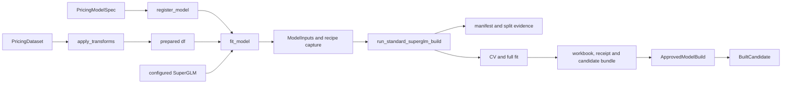

# How the package fits together

Start with `pricing_pipeline.notebook` for model work and
`pricing_pipeline.reporting` for reports. The packages underneath implement
those entry points. An internal function being importable does not make it
an analyst API.

For notebook generation, use the [argument-to-cell trace](scaffold-trace.md).
For individual files, use the [module index](module-index.md).

## The objects passed between steps

| Object | Produced by | Consumed by | Meaning |
|---|---|---|---|
| `PricingDataset` | Ingestion code or `PricingDataset.load` | `PricingModelSpec`, recipe `build`, data preparation | A dataframe snapshot with source, row keys and an as-at column. |
| `PricingModelSpec` | Analyst Python or recipe `build` | `register_model`, then `fit_model` through its registered reference | Column roles, transforms, validation and fit/export choices. |
| `RegisteredModel` | `register_model` or `load_registered_model` | Fit, lookup and deployment helpers | SQL identity and source directory. A lookup-only reference has no fitting spec. |
| `ModelInputs` | `fit_model` | `run_standard_superglm_build` | Aligned X, y, weights, offset and row keys. Internal to the training path. |
| `ApprovedModelBuild` | Standard builder or edit publication preparation | Publication validation and database writer | Immutable IDs, metrics and artifact hashes. The name does not imply deployment approval. |
| `BuiltCandidate` | `fit_model` | `save_model_version` | The registered reference plus completed-build evidence before package publication. |
| `CompletedModelPublishResult` | `save_model_version` or edit publication | Notebook display and later package selection | Saved SQL package/run identity and recipe revision. |
| `Candidate` | `load_model_version` | Editor, manual adjustment and deployment | A saved package with verified artifacts and the deployment snapshot reviewed with it. |
| `ModelRecipe` | `candidate.recipe`, `from_model` or `load` | TOML `save` or `build(dataset=...)` | Reusable declared configuration, excluding learned fit state. |

The similar names above are a discovery problem. In particular, `BuiltCandidate`
and `Candidate` refer to different stages, while `PricingModelSpec` and
`ApprovedModelBuild` refer to choices and completed evidence respectively.
Their class docstrings state these differences so IDE hover and `help()` can
explain them without a trip to this page.

## From data to a completed fit



| Handoff | Where to read | What to check |
|---|---|---|
| Source column to prepared column | [`data.transforms.apply_transforms`](../src/pricing_pipeline/data/transforms.py) | Mapping keys name outputs; transform objects name sources. |
| Prepared column to model role | [`notebook.fit_model`](../src/pricing_pipeline/notebook.py) | `spec.features` selects X; `target` selects y; weight and offset fields select their vectors. |
| Dataset to reproducible splits | [`data.manifest`](../src/pricing_pipeline/data/manifest.py) | Frame identity, ordered row keys, split positions and recorded SQL references. |
| Declared estimator to recipe | [`modeling.recipes.ModelRecipe.from_model`](../src/pricing_pipeline/modeling/recipes/__init__.py) | Capture constructor choices before CV/full fitting changes model state. |
| Inputs to fit outputs | [`modeling.standard_superglm.run_standard_superglm_build`](../src/pricing_pipeline/modeling/standard_superglm.py) | Validation, manifest creation, CV, full fit, export and final evidence record. |
| Fitted estimator to workbook metadata | [`publishing.metadata`](../src/pricing_pipeline/publishing/metadata.py), [`publishing.rating_tables`](../src/pricing_pipeline/publishing/rating_tables.py) | The receipt explains how exported term values relate to fitted features and transforms. |

Fitting already writes audit records and local files. Saving the rating package
is the next step. A fit is not a read-only preview.

## From a completed fit to SQL

`notebook.save_model_version` selects the local or remote path:

```text
local:
  publishing.sqlite.publish_sqlite_candidate
  -> PublicationRequest
  -> publishing.publish.publish_candidate
  -> publishing.sqlite.publish_sqlite

remote:
  orchestration.publish_completed_build.publish_completed_model_build
  -> verify candidate artifact against SQL manifest/split lineage
  -> orchestration.pipeline.publish_model_export
  -> PublicationRequest
  -> publishing.publish.publish_candidate
  -> publishing.sqlserver.publish_sqlserver
```

The common publisher checks files and prepares `RatingTables`. Each database
writer resolves retries under its transaction locks, verifies recipe evidence,
and saves the package and run lineage. SQL Server also verifies stored prediction
parity before marking the draft published. Recipe allocation belongs to
[`publishing.recipes`](../src/pricing_pipeline/publishing/recipes.py).

The result is a saved package. [`publishing.deployment`](../src/pricing_pipeline/publishing/deployment.py)
changes which package is active when `deploy_model_version` is called with a
reviewed candidate. Read the writer and deployment code separately when tracing
why a saved model is not the deployed model.

## From a saved version to an edited child

```text
load_model_version
-> Workbench.open: SQL package and lineage lookup
-> load_candidate_bundle: verify and deserialize fitted-model evidence
-> Candidate
-> analyst EditorSession or ManualAdjustmentPolicy
-> notebook.publish_edits / publish_manual_adjustment
-> workbench.submission.save_editor_submission
-> publishing.editor.publish_editor_submission
-> verify submission, reload parent and replay changes
-> PublicationRequest and common publication path
```

[`workbench.core`](../src/pricing_pipeline/workbench/core.py) owns lookup;
[`workbench.artifacts`](../src/pricing_pipeline/workbench/artifacts.py) owns model
files; [`workbench.submission`](../src/pricing_pipeline/workbench/submission.py)
owns proposed edit files. [`publishing.editor`](../src/pricing_pipeline/publishing/editor.py)
checks those edits before saving a child package. This workflow is implemented
through notebook helpers; `workbench` is not a separate GUI.

## From a baseline to monitoring evidence

Read [`modeling.monitoring`](../src/pricing_pipeline/modeling/monitoring.py)
in this order:

1. `ModelFitContract` and `MonitoringVariant` describe the baseline structure and permitted changes.
2. `run_monitoring_fit` verifies/binds the baseline and calls `materialize_monitoring_model` for the selected comparison.
3. The `_result_*` helpers extract terms, lambdas, relativities and metrics; invariant checks confirm the selected restrictions.
4. `MonitoringFitResult` carries those outputs into `persist_monitoring_fit`.
5. Persistence links the observation to its baseline run, deployment and dataset manifest.

Monitoring observations do not allocate deployable packages. The module currently
owns all these steps; its size is a refactoring priority in the [audit](dev-ux-audit.md).

## From predictions to an offline report

```text
reporting.build_scored_model_report
-> inputs.normalize_report_inputs -> ValidatedReportInputs
-> evidence.collect_model_evidence -> ModelEvidence per model
-> diagnostics.calculate_diagnostics -> DiagnosticSections
-> report.assemble_report_payload
-> _underwriter_html.render_underwriter_html
-> report.write_report_html -> UnderwriterReportResult
```

[`reporting.inputs`](../src/pricing_pipeline/reporting/inputs.py) aligns the
actuals, predictions and weights. [`reporting.evidence`](../src/pricing_pipeline/reporting/evidence.py)
defines the objects adapters return. `adapters.superglm` and
`adapters.rating_workbook` translate fitted models or workbooks into those objects.
`diagnostics` and `movement` calculate aggregates; the HTML module renders them.

`build_underwriter_report` is the convenience entry point that creates adapter
requests before calling the scored-report workflow. Reporting writes an HTML
artifact and returns aggregate results; it does not change model publication state.

## Follow or change a handoff

Use the called function's signature and return type to follow the next object.
Docstrings should name its producer or consumer when the type name alone is
ambiguous. Keep an explicit argument mapping at boundaries such as
`ScaffoldOptions` to renderer arguments or `PricingModelSpec` to `ModelInputs`.

When adding an option, check every stage it crosses: input parsing, validation,
conversion, persistence or rendering, and the eventual consumer. Update the
relevant trace and exercise the existing workflow test at that boundary.
