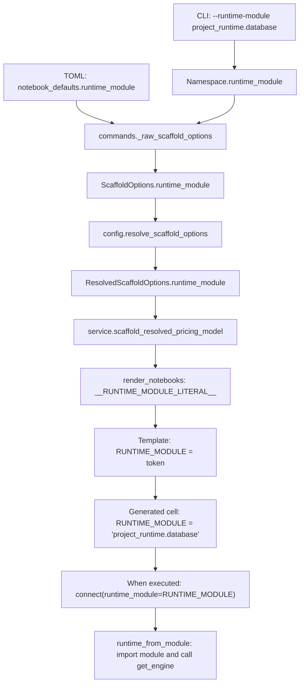

# From an argument to a notebook cell

The scaffold writes Python literals into notebook templates. It does not run
those notebooks or maintain a live link to `pricing_scaffold.toml`. Once generated,
the notebook's cells contain the values the analyst will execute.

## Follow one value

For `--runtime-module project_runtime.database`, follow this path:



| Step | Open this code | What happens |
|---|---|---|
| Parse the flag | [`cli.build_parser`](../src/pricing_pipeline/cli.py) | argparse changes `--runtime-module` into the `runtime_module` attribute. |
| Select the handler | [`cli.main` and `_HANDLERS`](../src/pricing_pipeline/cli.py) | `scaffold` calls `commands.run_scaffold`. |
| Read defaults and merge | [`commands.run_scaffold` and `_raw_scaffold_options`](../src/pricing_pipeline/scaffold/commands.py) | The explicit CLI value wins over TOML. |
| Validate | [`config.resolve_scaffold_options`](../src/pricing_pipeline/scaffold/config.py) | Check the dotted module name and produce resolved options. |
| Forward to rendering | [`service.scaffold_resolved_pricing_model`](../src/pricing_pipeline/scaffold/service.py) | Pass the same `ResolvedScaffoldOptions` object into `render_notebooks(options)`. |
| Substitute | [`render.render_notebooks`](../src/pricing_pipeline/scaffold/render.py) | `_python_literal` encodes the value and the token map selects its placeholder. |
| Read the cell | [`03_model_training.ipynb`](../src/pricing_pipeline/resources/scaffold/notebooks/03_model_training.ipynb) | The settings cell contains `RUNTIME_MODULE = __RUNTIME_MODULE_LITERAL__`. Notebook 02 fits locally and has no connection settings. |
| Write the file | [`service.scaffold_resolved_pricing_model`](../src/pricing_pipeline/scaffold/service.py) | Write the rendered JSON under `pricing_models/<package_name>`. |
| Execute later | [`notebook.connect`](../src/pricing_pipeline/notebook.py), [`infra.runtime`](../src/pricing_pipeline/infra/runtime.py) | In remote mode, import the module and obtain its engine. |

## Argument and token map

The column headed **field** names both the raw and resolved option field unless
specified otherwise. Template filenames below use their numeric prefixes.

| CLI flag | TOML fallback | Field | Template token | Generated use |
|---|---|---|---|---|
| `--model-name` | Required CLI value | `model_name` | `__MODEL_NAME__` | `MODEL_NAME` in 04/05/06; spec `name` in 02/03; policy name in 05. |
| `--target-name` | Required CLI value | `target_name` | `__TARGET_NAME__` | Data column in 01; spec `target` in 02/03. |
| `--model-label` | Derived from model name | `model_label` | `__MODEL_LABEL__`, `__MODEL_LABEL_MARKDOWN__` | Spec/lookup label and notebook titles. |
| `--model-type` | CLI default `superglm_poisson` | `model_type` | `__MODEL_TYPE__` | Spec `model_type` in 02/03. |
| `--deployment-slot` | `<model_name>_UAT` | `deployment_slot` | `__DEPLOYMENT_SLOT__` | Spec in 02/03; selection settings in 04/05/06. |
| `--package-name` | Lowercase model name with repeated underscores collapsed | `package_name` | `__PACKAGE_NAME__` | `MODEL_DIR` in every notebook and the output directory. |
| `--database-mode` | `notebook_defaults.database_mode` | `database_mode` | `__DATABASE_MODE_LITERAL__` | `DATABASE_MODE` in 01 and 03–06, and in `monitoring.py`. |
| `--runtime-module` | `notebook_defaults.runtime_module` | `runtime_module` | `__RUNTIME_MODULE_LITERAL__` | `RUNTIME_MODULE` in 01 and 03–06, and in `monitoring.py`. |
| `--expected-remote-database` | `notebook_defaults.expected_remote_database` | `expected_remote_database` | `__EXPECTED_REMOTE_DATABASE_LITERAL__` | `EXPECTED_REMOTE_DATABASE` in 01 and 03–06, and in `monitoring.py`. |
| `--manual-edit-source` | `manual_edit_defaults.source_selector` | `manual_edit_source_selector` | `__MANUAL_SOURCE_SELECTOR_LITERAL__` | `SOURCE_SELECTOR` in 05. |
| `--manual-edit-carry-forward` / `--no-manual-edit-carry-forward` | `manual_edit_defaults.carry_forward` | `manual_edit_carry_forward` | `__MANUAL_CARRY_FORWARD_LITERAL__` | `CARRY_FORWARD` in 05. |
| `--root` | Current directory | `root` | None | Select the project and output directory in commands/service. |
| `--config` | `<root>/pricing_scaffold.toml` | Namespace only | None | Select the TOML file before options are built. An explicit relative path is relative to the current working directory. |
| `--force` | False | `force` | None | Overwrite existing generated files in the service, subject to its path and legacy-file checks. |

The renderer also derives three placeholders. `__DATASET_NAME__` is
`<package_name>_model_frame`. `__FEATURE_NAME__` is `feature_1`, or `feature_2`
if that would collide with the target. `__PRIMARY_KEY__` is `row_id`, or
`record_id` if the target is `row_id`. These are example columns for analysts
to replace, not detected source-data features.

`ALLOW_REMOTE_WRITES` is a literal `False` in the templates. It has no scaffold
argument or TOML setting. Feature constructors, transforms and fit choices are
edited in the notebook or loaded through its explicit `RECIPE_PATH`.

## Change the right owner

| Desired change | Files to inspect |
|---|---|
| New CLI flag | `cli.build_parser`, `commands._raw_scaffold_options` |
| New TOML default | `resources/scaffold/pricing_scaffold.toml`, `config.ScaffoldConfig`, `config.load_scaffold_config`, then the command merge |
| New value passed to notebooks | Both option dataclasses, `resolve_scaffold_options`, the renderer token map and the affected templates. The service passes the options object unchanged. |
| Different explanation or model code in a cell | The `.ipynb` file under `resources/scaffold/notebooks` |
| Different folder or overwrite behavior | `scaffold.service` |
| Different connection behavior when a cell runs | `notebook.connect` and `infra.runtime` |

The Python helper `scaffold_pricing_model(ScaffoldOptions(...))` starts at
option validation. It does not read project TOML or apply CLI precedence.

## Verify the handoff

From the source checkout:

```bash
.venv/bin/python -m pytest -q tests/test_scaffold_pricing_model.py tests/cli/test_init_and_scaffold.py tests/test_packaged_resources.py
```

To inspect output without writing a project, use the internal renderer:

```python
from pricing_pipeline.scaffold.config import ScaffoldOptions, resolve_scaffold_options
from pricing_pipeline.scaffold.render import render_notebooks

options = resolve_scaffold_options(
    ScaffoldOptions(model_name="Motor_Frequency", target_name="ClaimNb")
)
notebooks = render_notebooks(options)
```

It returns a dictionary of filenames to JSON strings. The token map reads
`options.<field>` directly, so adding an option needs no extra service forwarding
argument. Stop here in a debugger when an option reaches the wrong cell.

See the [package flow guide](package-flows.md) for the same input-to-output
trace through fitting, saving, editing and reporting.

## Weekly script and notebook 07

`render_monitoring_module(options)` uses the same token encoding as the notebooks
and reads `resources/scaffold/monitoring.py.template`. The service writes the
result to `pricing_models/<package>/monitoring.py`. Its `load_dataset()` function
is where the analyst puts the current source query and enrichment steps.

Notebook 07 imports and calls that module's `run()`, so it shares the same
connection and dataset configuration as scheduled execution. The module's
`__main__` block calls `monitoring_runner.run_monitoring_script`, which adds
logging and process exit codes. Both paths reach `notebook.run_monitoring`,
`monitoring.batch`, and the existing SQL fit/persistence/publication functions.
Scaffolding preserves edited modules and notebooks unless `--force` is explicit.
