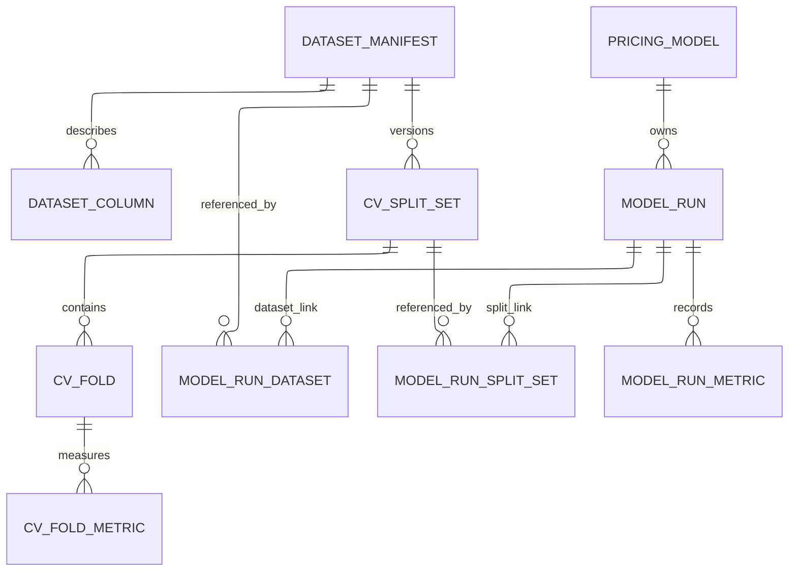
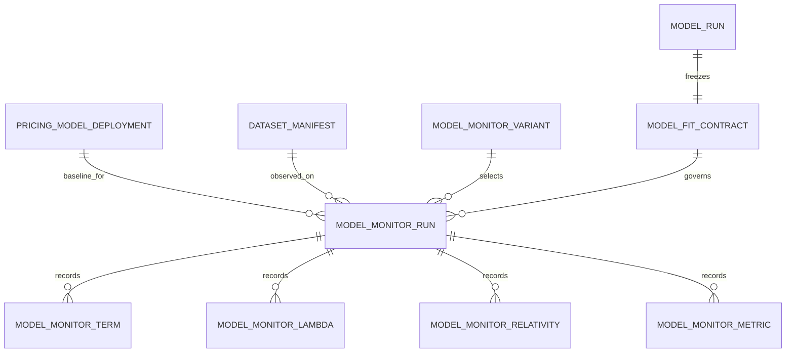
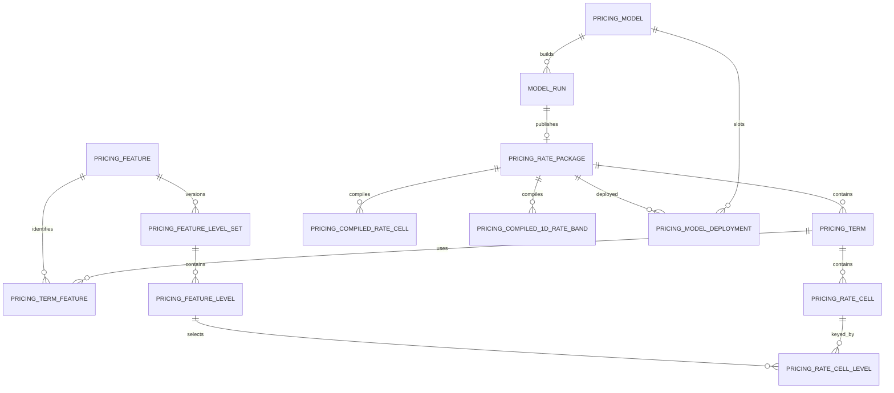
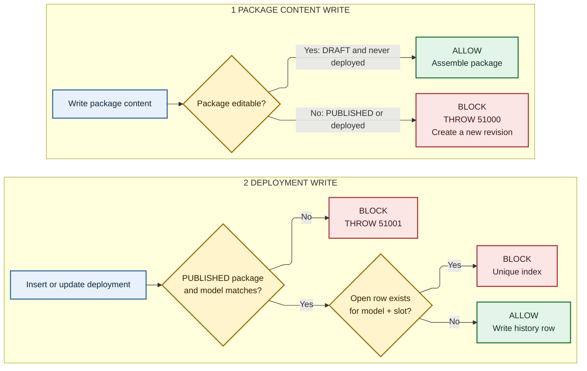

# SQL schema and migration runbook

The authoritative SQL Server schema is the ordered packaged migration chain in
`pricing_pipeline.resources.migrations`. Apply every file in order through the
latest version; do not run a single late migration against an unknown baseline.

Configured schema names may differ at work. This guide uses the defaults:
`pricing`, `pricing_stg`, and `mlops`.

## Schema ownership

| Schema | Purpose |
|---|---|
| `pricing` | Dataset manifests, validation definitions, model registry/runs, immutable rating packages, deployments, read views, scoring procedures |
| `pricing_stg` | Short-lived workbook publication payload and retained export receipt |
| `mlops` | Normalized run lineage plus controlled deployed-model monitoring evidence |
| `dbo` | `SCHEMA_MIGRATION` checksums/status and `SCHEMA_CONFIGURATION` schema-name lock |

## Data and run lineage



Core meaning:

| Table | Useful identity/evidence |
|---|---|
| `pricing.DATASET_MANIFEST` | `manifest_id`, signature, dataset/source, data-as-at date and column, frame hash, row count, PK/target/weight/offset/export metadata |
| `pricing.DATASET_COLUMN` | Manifest column role, dtype, null/distinct/statistics evidence |
| `pricing.CV_SPLIT_SET` | Deterministic validation configuration and exact split identity for one manifest |
| `pricing.CV_FOLD` / `CV_FOLD_METRIC` | Fold materialization and fold-level results |
| `pricing.PRICING_MODEL` | Stable business model identity and status |
| `pricing.MODEL_RUN` | One build: manifest, kind, equivalence hash, source/runtime/artifact evidence, status, parent lineage, package link |
| `mlops.MODEL_RUN_DATASET` | Normalized run-to-training-manifest assertion |
| `mlops.MODEL_RUN_SPLIT_SET` | Normalized run-to-validation-split assertion |
| `mlops.MODEL_RUN_METRIC` | Run metrics and scope |

`MODEL_RUN.manifest_id` is the direct operational link. The normalized `mlops`
links are intentionally retained because publication, equivalence lookup, and
lineage integrity checks use them. Validation split lineage is read from
`MODEL_RUN_SPLIT_SET`; SQL Server `MODEL_RUN` has no direct `split_set_id`. The
direct manifest foreign key is stated here instead of drawn so it does not cross
the two normalized link paths in the diagram.

## Controlled monitoring lineage

Monitoring is attached to an exact deployed run. It does not create
`MODEL_RUN` or `PRICING_RATE_PACKAGE` rows and therefore cannot become a
deployment by accident.



| Table | Purpose |
|---|---|
| `mlops.MODEL_MONITOR_VARIANT` | The four interpretable presets: static, coefficient-only frozen, fixed-knot lambda refit, and full adaptive refit |
| `mlops.MODEL_FIT_CONTRACT` | One immutable canonical contract per baseline run, including exact SuperGLM structure, fitted geometry, lambdas, and comparison grids |
| `mlops.MODEL_MONITOR_RUN` | One component/variant observed against one baseline deployment and one dated dataset manifest, bound to the exact ordered frame, fit configuration, and complete result digest |
| `mlops.MODEL_MONITOR_TERM` | Per-run feature kind, order, structural digest, and JSON metadata |
| `mlops.MODEL_MONITOR_LAMBDA` | Smoothing component value and whether it was baseline, fixed, or estimated |
| `mlops.MODEL_MONITOR_RELATIVITY` | Relativities on stable categorical levels or the baseline continuous grid |
| `mlops.MODEL_MONITOR_METRIC` | Lightweight fit/score metrics |

Every variant freezes categorical grouping and level universes, special levels,
bases/unseen handling, feature types/order, basis type/dimension/penalty order,
and monotonic/shape constraints. Only the switches declared by the variant may
move. Python refuses persistence unless its post-fit guard verifies protected
lambdas and every fixed-lambda history step exactly, verifies protected knot
and boundary arrays exactly, and hashes an exact structural match. The run row
stores the canonical invariant evidence, ordered-frame digest, fit configuration,
and a digest over every term, lambda, relativity, metric, and invariant result.
Only one observation may exist for
`deployment + manifest + component + variant`; an exact concurrent retry
deduplicates, while different evidence for that same observation is rejected. A
new data-as-at manifest remains a new observation.

For frequency and severity components, four variants across 52 weekly
snapshots means at most 416 small evidence runs per year. The heavier rows are
relativity points, not duplicated workbooks or rate packages, so this is modest
SQL volume. A proper model refresh creates and deploys a new package, which
starts a new baseline contract epoch.

Important columns are deliberately distinct:

| Column | Meaning |
|---|---|
| `data_as_of_date` | Dataset version date: the last date for which source data is complete |
| `data_as_of_column` | Name of the governed frame column that supplied that date |
| `model_kind` | Semantic class: `RAW`, `ROUTINE_EDIT`, `EDITOR_EDIT`, or `MANUAL_EDIT` |
| `model_equivalence_sha256` | Canonical final rating semantics used for duplicate prevention |
| `manifest_signature_sha256` | Canonical dataset snapshot identity |
| `parent_model_run_id` / `parent_rate_package_id` | Editor/revision provenance, not deployment state |
| `model_version` / `package_version` | Trained-model version versus immutable rating-package revision |
| `effective_*` | Business/package/deployment validity, depending on the owning table |
| `created_*` | Audit actor/time; never a substitute for data-as-at or effective dates |
| `mlflow_run_id` | Optional external trace; the notebook workflow does not require or create it |

## Rating package and deployment



| Table | Purpose |
|---|---|
| `pricing.PRICING_RATE_PACKAGE` | Versioned package header, base rate, effective dates, status, parent package |
| `pricing.PRICING_TERM` / `PRICING_TERM_FEATURE` | Ordered model terms and their feature/level-set references |
| `pricing.PRICING_RATE_CELL` / `PRICING_RATE_CELL_LEVEL` | Normalized factor cells, levels, coefficients, relativities, weights |
| `pricing.PRICING_FEATURE*` | Reusable feature and level-set dictionaries required by publication/scoring |
| `pricing.PRICING_COMPILED_*` | Package-specific scoring projections |
| `pricing.PRICING_MODEL_DEPLOYMENT` | Full deployment history; one open row per model and slot is the current package |
| `pricing.PRICING_MODEL_VERSION_RESERVATION` | Concurrent model-version allocation |

Package state is `DRAFT` during assembly and `PUBLISHED` after successful
validation. Published/deployed package content is immutable; change means a new
package. Deploying closes the old open history row and inserts a new one.

A `MANUAL_EDIT` is a new child run/package, never an update to its parent.
`PRICING_RATE_PACKAGE.revision_metadata_json` carries the canonical relative
adjustment policy, its SHA-256, analyst reason, session/artifact evidence, and
parent IDs. The normalized rating tables hold the resulting final
relativities. A carry-forward policy is replayed in Python against a later
clean candidate; SQL records the policy and outcome but does not perform the
adjustment.

`pricing.PRICING_PACKAGE_POINTER` is a compatibility table still dual-written
by deployment code. Current repo reads use `PRICING_MODEL_DEPLOYMENT`; do not
build new consumers on the pointer table.

`pricing.FREMTPL_RAW` is demo input data, not a registry or production lineage
table.

## Staging

`pricing_stg.STG_RATING_EXPORT`, `STG_RATE_CELL`, `STG_CELL_LEVEL`, and
`STG_TERM_METADATA` receive a validated Python export. Publication consumes the
children transactionally. After a successful publication, child rows are
deleted and the one-row export header remains as the retry/audit receipt. Draft
or failed publication retains its staging evidence.

The normal duplicate decision happens in Python before these rows are written.
SQL recomputes/checks the semantic hash and uses filtered unique indexes as a
concurrency backstop:

- one dataset row per non-null `manifest_signature_sha256`;
- one successful run per
  `(model_id, manifest_id, model_kind, model_equivalence_sha256)`; and
- one open deployment per `(model_id, deployment_slot)`.

## Triggers

| Trigger | Rule |
|---|---|
| `TR_PRICING_RATE_PACKAGE_IMMUTABLE_UPDATE_DELETE` | A published or deployed package header cannot be updated/deleted. |
| `TR_PRICING_TERM_IMMUTABLE_WRITE` | Blocks term changes under immutable packages. |
| `TR_PRICING_TERM_FEATURE_IMMUTABLE_WRITE` | Blocks term-feature changes under immutable packages. |
| `TR_PRICING_RATE_CELL_IMMUTABLE_WRITE` | Blocks rate-cell changes under immutable packages. |
| `TR_PRICING_RATE_CELL_LEVEL_IMMUTABLE_WRITE` | Blocks cell-level changes under immutable packages. |
| `TR_PRICING_FEATURE_IMMUTABLE_WRITE` | Protects feature rows referenced by immutable packages. |
| `TR_PRICING_FEATURE_LEVEL_SET_IMMUTABLE_WRITE` | Protects referenced level sets. |
| `TR_PRICING_FEATURE_LEVEL_IMMUTABLE_WRITE` | Protects referenced levels. |
| `TR_PRICING_COMPILED_RATE_CELL_IMMUTABLE_WRITE` | Protects compiled cells. |
| `TR_PRICING_COMPILED_1D_RATE_BAND_IMMUTABLE_WRITE` | Protects compiled 1D bands. |
| `TR_PRICING_MODEL_DEPLOYMENT_PACKAGE_GUARD` | Deployment package must be `PUBLISHED` and belong to the same model. |
| `TR_PRICING_MODEL_DEPLOYMENT_MONITORING_LINEAGE_GUARD` | A deployment referenced by monitoring may be closed normally, but its model, package, slot, start time, and identity cannot be changed or deleted. |
| `TR_DATASET_MANIFEST_MONITORING_LINEAGE_GUARD` | A dataset manifest referenced by monitoring evidence cannot be changed or deleted. |
| `mlops.TR_MODEL_FIT_CONTRACT_IMMUTABLE` | A baseline fit contract cannot be changed or deleted. |
| `mlops.TR_MODEL_FIT_CONTRACT_LINEAGE_GUARD` | A contract must identify one successful run and its published package. |
| `mlops.TR_MODEL_MONITOR_RUN_LINEAGE_GUARD` | Contract, deployed package, model run, and monitoring row must identify one baseline. |
| `mlops.TR_MODEL_MONITOR_RUN_IMMUTABLE` | A completed monitoring run is append-only. |
| `mlops.TR_MODEL_MONITOR_TERM_IMMUTABLE` | Per-term monitoring evidence is append-only. |
| `mlops.TR_MODEL_MONITOR_LAMBDA_IMMUTABLE` | Monitoring lambda evidence is append-only. |
| `mlops.TR_MODEL_MONITOR_RELATIVITY_IMMUTABLE` | Monitoring relativity evidence is append-only. |
| `mlops.TR_MODEL_MONITOR_METRIC_IMMUTABLE` | Monitoring metric evidence is append-only. |



Foreign keys, checks, and unique indexes enforce the structural rules; triggers
cover state-dependent rules that ordinary constraints cannot express.

## Read views and scoring

| Object | Intended use |
|---|---|
| `pricing.V_MODEL_RELATIVITY` | Internal normalized relativity base used by the enriched final view |
| `pricing.V_FINAL_MODEL_RELATIVITY` | All package relativities with model kind/equivalence, full manifest/data-as-at evidence, and unambiguous validation split lineage |
| `pricing.V_MODEL_CANDIDATE_RELATIVITY` | All published candidate relativities for review/BI |
| `pricing.V_CURRENT_DEPLOYED_RELATIVITY` | Only the open deployed package per model/slot, including deployment metadata |
| `pricing.V_MODEL_VALIDATION_SPLIT` | Validation configuration/fold evidence per run |
| `pricing.V_MODEL_VALIDATION_SUMMARY` | Run and fold metric summary |
| `pricing.V_MODEL_LINEAGE_REDUNDANCY_CHECK` | Missing, duplicated, or mismatched run/manifest/split links; healthy rows say `OK` |
| `pricing.V_MODEL_MONITORING_RUN` | One row per monitoring preset with baseline deployment and full manifest/data-as-at evidence |
| `pricing.V_MODEL_MONITORING_RELATIVITY` | Stable point-level relativities for week/variant comparisons |
| `pricing.V_MODEL_MONITORING_LAMBDA` | Smoothing lambdas and fixed/estimated mode for week/variant comparisons |
| `pricing.PREDICT_RATE_PACKAGE` | Score an explicitly selected package |
| `pricing.PREDICT_CURRENT_RATE` | Resolve the current deployment, then score through the package procedure |

Compatibility/read convenience surfaces remain for existing consumers:

- `V_PUBLISHED_MODEL_RELATIVITY` is an alias of
  `V_MODEL_CANDIDATE_RELATIVITY`.
- `V_ACTIVE_MODEL`, `V_CURRENT_RATE_PACKAGE`, `V_CURRENT_RATE_CELL`,
  `V_CURRENT_1D_RATE_BAND`, and `V_CURRENT_DATASET_CV_FOLD` are retained, but
  current notebook code does not depend on them directly.

No grouped duplicate-report views exist for manifests or equivalent models:
their filtered unique indexes make those duplicate rows impossible. The lineage
view remains useful because link inconsistency can still exist.

## Redundancy assessment

| Surface | Assessment |
|---|---|
| `MODEL_RUN.manifest_id` plus `mlops.MODEL_RUN_DATASET` | Intentional for now: direct lookup plus normalized role-based integrity. Both are checked for agreement. |
| `PRICING_PACKAGE_POINTER` | Compatibility-only; a retirement candidate after every external consumer has moved to deployment history. |
| `V_PUBLISHED_MODEL_RELATIVITY` | Compatibility alias; new consumers should use `V_MODEL_CANDIDATE_RELATIVITY`. |
| `V_ACTIVE_MODEL`, `V_CURRENT_RATE_*`, `V_CURRENT_DATASET_CV_FOLD` | Low use in current Python code, but cheap read contracts retained for SQL consumers. Remove only with a consumer inventory and migration. |
| Normalized cells plus `PRICING_COMPILED_*` | Not duplicate authority: normalized rows are audit structure; compiled rows are package-specific scoring projections. |
| Staging export header after child cleanup | Deliberate retry receipt, not abandoned staging data. |

The useful default for analysis is `V_FINAL_MODEL_RELATIVITY`; use the candidate
or current-deployed views when package state matters. Avoid joining the raw
tables unless a view omits evidence you actually need.

## Apply migrations at work

Use this for a database with data you want to retain:

```bash
uv run python scripts/apply_schema.py \
  --runtime-module work_runtime.database \
  --expected-database PricingAudit
```

The command:

1. connects through the runtime module;
2. checks `SELECT DB_NAME()` against the explicit expected name (or the runtime
   setting when the option is omitted);
3. locks migration execution;
4. verifies checksums of previously applied files; and
5. applies only missing migrations in order.

Do not edit an already-applied migration. Add the next `VNNN__description.sql`.

After applying, check:

```sql
SELECT *
FROM dbo.SCHEMA_MIGRATION
ORDER BY version_file;

SELECT *
FROM pricing.V_MODEL_LINEAGE_REDUNDANCY_CHECK
WHERE redundancy_status <> 'OK';
```

## Reset only a disposable schema

First run the reset command without `--execute`; it validates the target and
prints the drop plan without changing anything:

```bash
uv run python scripts/reset_remote_pricing_schema.py \
  --runtime-module work_runtime.database \
  --expected-database PricingAudit
```

Only if that database/schema is disposable:

```bash
uv run python scripts/reset_remote_pricing_schema.py \
  --runtime-module work_runtime.database \
  --expected-database PricingAudit \
  --execute \
  --i-understand-this-drops-pricing-objects
```

Execution drops objects in the runtime-owned pricing, staging, and mlops
schemas, drops the two `dbo` tracking tables, then reapplies the full migration
chain in one transaction. Do not use reset for an environment with model or
deployment history that must survive.

## Diagrams and SQLite parity

The Mermaid diagrams above are intentionally split by concern. For a catalog-
derived ERD from a configured SQL Server, run:

```bash
uv run python scripts/generate_db_diagrams.py \
  --schemas pricing mlops \
  --output-dir state/db_diagrams
```

The committed standalone Mermaid sources are:

- `docs/sql/diagrams/01_data_run_lineage.mmd`
- `docs/sql/diagrams/02_controlled_monitoring_lineage.mmd`
- `docs/sql/diagrams/03_rating_package_deployment.mmd`
- `docs/sql/diagrams/04_trigger_guards.mmd`

With Mermaid CLI (`mmdc`) and Chafa installed, render and preview all three in a
Kitty terminal:

```bash
uv run python scripts/render_schema_diagrams.py --preview
```

The preview command uses `chafa -f kitty --fit-width`. Rendered SVGs go to
`state/db_diagrams/` by default. The renderer disables Mermaid HTML labels so
Chafa receives native SVG `<text>` elements, and uses a white background so
black labels remain visible in dark terminals.

Local notebooks bootstrap an equivalent SQLite audit schema and views for
workflow testing. SQL Server migrations remain authoritative for production;
trigger/procedure behavior is covered by migration/static tests where SQLite
cannot execute T-SQL.

The Mermaid sources and the on-demand schema-rendering commands above are the
maintained ERD guidance. Their generated output belongs in ignored state
directories; do not commit copied runnable SQL.
