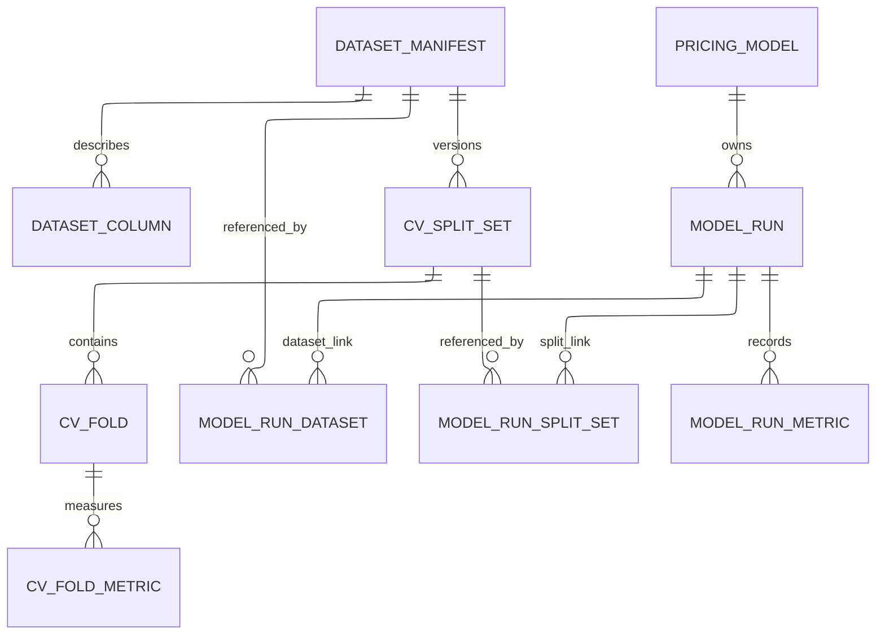
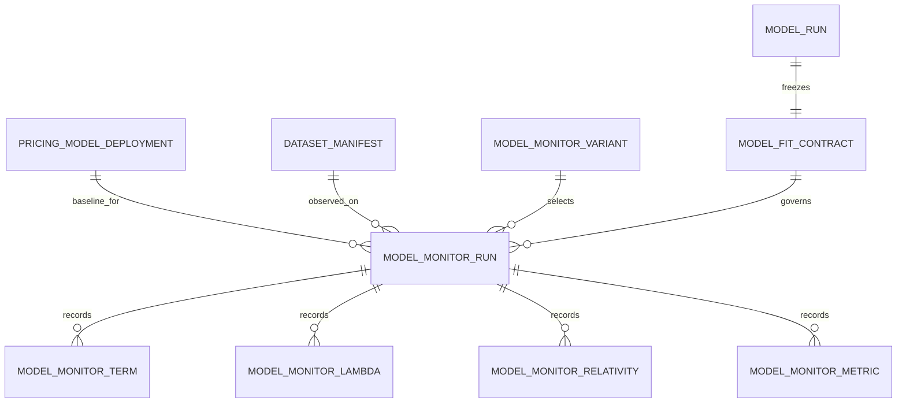
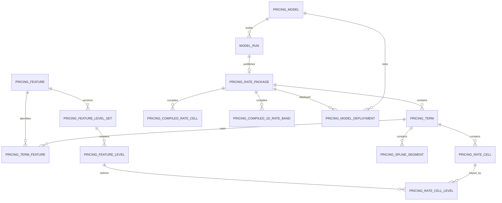
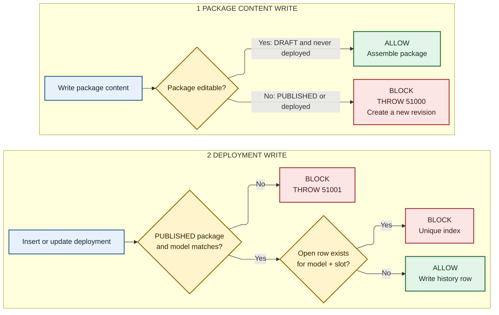

# SQL schema and migration runbook

The authoritative SQL Server schema is the ordered packaged migration chain in
`pricing_pipeline.resources.migrations`. Apply every file in order through the
latest version; do not run a single late migration against an unknown baseline.

Schema names are configurable. This guide uses the defaults:
`pricing`, `pricing_stg`, and `mlops`.

## Read the schema without knowing the internal names

Every current table and view has an `MS_Description` extended property after
V039. It explains the object's purpose, what one row represents, and when to
use it. View definitions also contain the explanation directly after `AS`,
so it appears when you script or inspect the view. SQL Server does not retain
the original `CREATE TABLE` text; table descriptions live in object properties.
The local SQLite DDL has the same comments inside its table and view definitions.

In SSMS, open an object's Properties and select Extended Properties, or run:

```sql
SELECT
    SCHEMA_NAME(o.schema_id) AS schema_name,
    o.name AS object_name,
    o.type_desc,
    CAST(p.value AS NVARCHAR(3500)) AS description
FROM sys.objects AS o
JOIN sys.extended_properties AS p
  ON p.class = 1 AND p.major_id = o.object_id AND p.minor_id = 0
WHERE o.type IN ('U', 'V')
  AND p.name = N'MS_Description'
ORDER BY schema_name, object_name;
```

Some existing names describe implementation details:

| Name | Meaning |
|---|---|
| Feature | An input, such as driver age or region. |
| Level | A category or numeric band for an input. |
| Term | A model effect, such as driver age or driver age by region. |
| Rate cell | One rating multiplier for a level or combination of levels. A multiplier of 1.12 increases the base rate by 12% for that effect. |
| Compiled | A derived lookup representation used by SQL scoring. |
| Spline segment | An exact polynomial log effect on a numeric interval or a constant tail. |
| Final model relativity | Every exported effect, including spline coefficients, with model and dataset context. "Final" does not mean latest, approved, published, or deployed. |

Start with `V_FINAL_MODEL_RELATIVITY` to compare all package versions,
`V_MODEL_CANDIDATE_RELATIVITY` for published packages, and
`V_CURRENT_DEPLOYED_RELATIVITY` for current deployments. Include the deployment
slot when using the last view because a package can be deployed in several slots.
These views include exact spline effects. Read `representation` to distinguish
fixed lookup values from coefficients that need an input. `V_MODEL_SPLINE_SEGMENT`
remains available for consumers that specifically want only spline segments.

## Schema ownership

| Schema | Purpose |
|---|---|
| `pricing` | Dataset manifests, validation definitions, model registry/runs, immutable rating packages, deployments, read views, scoring procedures |
| `pricing_stg` | Short-lived workbook publication payload and retained export receipt |
| `mlops` | Normalized run lineage plus controlled deployed-model monitoring evidence |
| `dbo` | `SCHEMA_MIGRATION` checksums/status and `SCHEMA_CONFIGURATION` schema-name lock |

## SQL monitoring baselines, V049

Apply the migration chain through V052 before publishing with this version.
V049 adds `pricing.MODEL_MONITORING_BASELINE`. It retains existing data and does
not recreate model notebooks. Each successful publication captures one immutable
row containing explicit JSON model state and its source lineage. Unsupported
snapshot configurations record `capture_status = 'UNAVAILABLE'` and a reason.

The snapshot includes constructor settings, fitted geometry and lambdas, exact
scoring parameters and aggregate categorical reference counts. It contains no
training rows or serialized Python objects. Its source identity links to the
model run, package, recipe, receipt and dataset. Digest and lineage checks run
when loading the baseline and saving monitoring observations.

`mlops.MODEL_FIT_CONTRACT` remains the comparison contract, including the selected
relativity evaluation grid. The new table supplies enough state to start the
weekly run on another machine. They have different purposes.

An older publication has no new state until an explicit one-time capture uses its
verified saved model. See [the notebook upgrade example](../notebooks/README.md#sql-baselines-and-existing-notebooks).
New publications capture the state inside their publication transaction.

```sql
SELECT model_run_id, capture_status, unavailable_reason,
       snapshot_schema_version, superglm_version, snapshot_sha256
FROM pricing.MODEL_MONITORING_BASELINE;
```

## Champion and challenger packages, V050

`mlops.MODEL_MONITOR_PUBLICATION` links a sealed refit observation to the exact
published model run. It is immutable and has one row per published challenger.
`STATIC_SCORE` represents the champion and creates no new package. Distinct
variants keep distinct package identities even when their rates happen to match.

`pricing.V_MODEL_CHALLENGER` joins the candidate package, its monitoring variant,
baseline and dated dataset with the current deployment. Use it to list weekly
challengers. The champion remains the open row in
`pricing.PRICING_MODEL_DEPLOYMENT` for the selected model and slot; the link table
does not introduce another deployment status.

A successful challenger publication also needs a captured SQL monitoring
snapshot. New snapshots keep the original declared knot and lambda policies
separately from the actual execution settings. This allows later adaptive refits
after a frozen challenger is promoted. Older snapshot v1 remains readable.

## Model registry, V051

Use `pricing.V_MODEL_REGISTRY` to see the champion, challengers and former
champions together. It includes ordinary training builds and weekly refits.
It adds no tables and changes no existing deployment or historical recipe.

```sql
SELECT model_name, deployment_slot, role, definition_revision, refit_type,
       data_as_of_date, published_at, package_version, model_run_id
FROM pricing.V_MODEL_REGISTRY
WHERE model_name = 'BURN_COST'
ORDER BY deployment_slot, package_version DESC;
```

`definition_revision` is the declared recipe revision. Weekly refits inherit it,
including the original validation plan. Their actual execution skips CV and
records its frozen or re-estimated controls in the monitoring evidence and SQL
snapshot. Changing declared features, grouping, transforms or fitting policies
through an analyst build creates or reuses the corresponding recipe revision.
Legacy recipes have a NULL revision and an explicit `recipe_status`.

`package_version` and `model_run_id` identify individual saved results. The old
`model_version` counter is exposed here as `fit_version` for audit joins.
`published_at` is the UTC publication time, separate from the dataset's as-at date
and the deployment time. Promotion changes the role without fitting or renumbering.

The view has one row per package and known deployment slot. Filter the slot
before counting packages across models with multiple slots. Ordinary builds can
appear in every known slot; monitoring packages belong to their originating slot.
A model with no deployment history has a NULL slot and challenger rows. A replaced
champion is `FORMER_CHAMPION` in that slot, preserving its deployment history.

`mlops.TR_MODEL_MONITOR_PUBLICATION_RECIPE` rejects new monitoring publications
that change their baseline's recipe. Existing recorded revisions remain intact.
The narrower `pricing.V_MODEL_CHALLENGER` remains available for existing queries.

`mlops.TR_MODEL_MONITOR_PUBLICATION_LINEAGE_GUARD` checks the observation and
candidate on insertion; `mlops.TR_MODEL_MONITOR_PUBLICATION_IMMUTABLE` rejects
updates and deletions. `pricing.TR_DATASET_MANIFEST_CHALLENGER_IDENTITY` preserves
the baseline dataset identity once a challenger publication references it.

SQL-only review and promotion need no local fitted model files. The promotion
transaction checks the package and deployment IDs seen during review.

## Data and run lineage



Core meaning:

| Table | Useful identity/evidence |
|---|---|
| `pricing.DATASET_MANIFEST` | `manifest_id`, signature, dataset/source, data-as-at date and column, frame hash, row count, PK/target/weight/offset/export metadata |
| `pricing.DATASET_COLUMN` | Manifest column role, dtype, null/distinct/statistics evidence |
| `pricing.CV_SPLIT_SET` | Deterministic validation configuration and exact split identity for one manifest |
| `pricing.CV_FOLD` / `CV_FOLD_METRIC` | Fold materialization and fold-level results |
| `pricing.PRICING_MODEL` | Stable business model identity and status |
| `pricing.MODEL_RUN` | One build: manifest, kind, equivalence hash, source/runtime/artifact evidence, status, parent lineage, package link |
| `mlops.MODEL_RUN_DATASET` | Normalized run-to-training-manifest assertion |
| `mlops.MODEL_RUN_SPLIT_SET` | Normalized run-to-validation-split assertion |
| `mlops.MODEL_RUN_METRIC` | CV scores with scope `cv`; full-training diagnostics with scope `full_fit` |

`MODEL_RUN.manifest_id` is the direct operational link. The normalized `mlops`
links are intentionally retained because publication, equivalence lookup, and
lineage integrity checks use them. Validation split lineage is read from
`MODEL_RUN_SPLIT_SET`; SQL Server `MODEL_RUN` has no direct `split_set_id`. The
direct manifest foreign key is stated here instead of drawn so it does not cross
the two normalized link paths in the diagram.

New standard builds save full-training diagnostics alongside CV scores. Migration
V046 exposes them as `fit_*` columns in `pricing.V_MODEL_VALIDATION_SUMMARY`.
No new table is required.

| Columns | Meaning |
|---|---|
| `fit_converged`, `fit_n_iter` | Coefficient solver convergence and reported iteration count |
| `fit_effective_df`, `fit_phi` | Total effective degrees of freedom and fitted dispersion |
| `fit_deviance`, `fit_null_deviance`, `fit_explained_deviance` | Training fit and its intercept-only comparison |
| `fit_log_likelihood`, `fit_null_log_likelihood`, `fit_pearson_chi2` | Full-training fit statistics reported by SuperGLM |
| `fit_n_obs`, `fit_likelihood_size` | Observation count and likelihood size reported by SuperGLM |
| `fit_reml_enabled`, `fit_reml_converged`, `fit_reml_n_iter` | Whether REML ran, its separate convergence result and outer iteration count |

Flags use 1 for true and 0 for false. Missing or non-finite diagnostics are
omitted from the metric table and appear as NULL in the view. Older runs are
not backfilled. These diagnostics belong to the actual full-data fit; editor
and manual revisions do not inherit their parent's solver diagnostics.
`fit_deviance` is the training total reported by SuperGLM, whereas CV deviance
scores may be normalized. Do not compare their raw magnitudes as a train/test gap.

The summary retains its existing scope: runs without fold evidence are absent.
In local SQLite mode, persistent views cannot join the separately attached
`mlops` database. Pooled CV and full-fit columns therefore remain NULL in the
local summary. The actual saved values are available directly:

```sql
SELECT model_run_id, metric_name, metric_value
FROM mlops.MODEL_RUN_METRIC
WHERE metric_scope = 'full_fit'
ORDER BY model_run_id, metric_name;
```

## Controlled monitoring lineage

Monitoring is attached to an exact deployed run. It does not create
`MODEL_RUN` or `PRICING_RATE_PACKAGE` rows and therefore cannot become a
deployment by accident.



| Table | Purpose |
|---|---|
| `mlops.MODEL_MONITOR_VARIANT` | The four interpretable presets: static, coefficient-only frozen, fixed-knot lambda refit, and full adaptive refit |
| `mlops.MODEL_FIT_CONTRACT` | One immutable canonical contract per baseline run, including exact SuperGLM structure, fitted geometry, lambdas, and comparison grids |
| `mlops.MODEL_MONITOR_RUN` | One component/variant observed against one baseline deployment and one dated dataset manifest, bound to the exact ordered frame, fit configuration, and complete result digest |
| `mlops.MODEL_MONITOR_TERM` | Per-run feature kind, order, structural digest, and JSON metadata |
| `mlops.MODEL_MONITOR_LAMBDA` | Smoothing component value and whether it was baseline, fixed, or estimated |
| `mlops.MODEL_MONITOR_RELATIVITY` | Relativities on stable categorical levels or the baseline continuous grid |
| `mlops.MODEL_MONITOR_METRIC` | Lightweight fit/score metrics |

Every variant freezes categorical grouping and level universes, special levels,
bases/unseen handling, feature types/order, basis type/dimension/penalty order,
and monotonic/shape constraints. Only the switches declared by the variant may
move. Python refuses persistence unless its post-fit guard verifies protected
lambdas and every fixed-lambda history step exactly, verifies protected knot
and boundary arrays exactly, and hashes an exact structural match. The run row
stores the canonical invariant evidence, ordered-frame digest, fit configuration,
and a digest over every term, lambda, relativity, metric, and invariant result.
Only one observation may exist for
`deployment + manifest + component + variant`; an exact concurrent retry
deduplicates, while different evidence for that same observation is rejected. A
new data-as-at manifest remains a new observation.

For frequency and severity components, four variants across 52 weekly
snapshots means at most 416 small evidence runs per year. The heavier rows are
relativity points, not duplicated workbooks or rate packages, so this is modest
SQL volume. A proper model refresh creates and deploys a new package, which
starts a new baseline contract epoch.

Important columns are deliberately distinct:

| Column | Meaning |
|---|---|
| `data_as_of_date` | Dataset version date: the last date for which source data is complete |
| `data_as_of_column` | Name of the governed frame column that supplied that date |
| `model_kind` | Semantic class: `RAW`, `ROUTINE_EDIT`, `EDITOR_EDIT`, or `MANUAL_EDIT` |
| `model_equivalence_sha256` | Canonical final rating semantics used for duplicate prevention |
| `manifest_signature_sha256` | Canonical dataset snapshot identity |
| `parent_model_run_id` / `parent_rate_package_id` | Editor/revision provenance, not deployment state |
| `model_version` / `package_version` | Trained-model version versus immutable rating-package revision |
| `effective_*` | Business/package/deployment validity, depending on the owning table |
| `created_*` | Audit actor/time; never a substitute for data-as-at or effective dates |
| `mlflow_run_id` | Optional external trace; the notebook workflow does not require or create it |

## Rating package and deployment



| Table | Purpose |
|---|---|
| `pricing.PRICING_RATE_PACKAGE` | Versioned package header, base rate, effective dates, status, parent package |
| `pricing.PRICING_TERM` / `PRICING_TERM_FEATURE` | Ordered model terms and their feature/level-set references |
| `pricing.PRICING_RATE_CELL` / `PRICING_RATE_CELL_LEVEL` | Normalized factor cells, levels, coefficients, relativities, weights |
| `pricing.PRICING_FEATURE*` | Reusable feature and level-set dictionaries required by publication/scoring |
| `pricing.PRICING_COMPILED_*` | Package-specific scoring projections |
| `pricing.PRICING_SPLINE_SEGMENT` | Exact polynomial segments keyed by package, term, and `segment_order`; FLOAT bounds and coefficients, feature name, level label, and weight |
| `pricing.PRICING_MODEL_DEPLOYMENT` | Full deployment history; one open row per model and slot is the current package |
| `pricing.PRICING_MODEL_VERSION_RESERVATION` | Concurrent model-version allocation |

Package state is `DRAFT` during assembly and `PUBLISHED` after successful
validation. Published/deployed package content is immutable; change means a new
package. Deploying closes the old open history row and inserts a new one.

A `MANUAL_EDIT` is a new child run/package, never an update to its parent.
`PRICING_RATE_PACKAGE.revision_metadata_json` carries the canonical relative
adjustment policy, its SHA-256, analyst reason, session/artifact evidence, and
parent IDs. The normalized rating tables hold the resulting final
relativities. A carry-forward policy is replayed in Python against a later
clean candidate; SQL records the policy and outcome but does not perform the
adjustment.

V039 removes `pricing.PRICING_PACKAGE_POINTER`. Deployment history already
records the selected package for each model and slot. The deployment writer
now updates only `PRICING_MODEL_DEPLOYMENT` and uses one timestamp for closing
the old interval and starting the new one.

`pricing.FREMTPL_RAW` is demo input data, not a registry or production lineage
table.

## Staging

`pricing_stg.STG_RATING_EXPORT`, `STG_RATE_CELL`, `STG_CELL_LEVEL`, and
`STG_TERM_METADATA` receive a validated Python export. Publication consumes the
children transactionally. After a successful publication, child rows are
deleted and the one-row export header remains as the retry/audit receipt. Draft
or failed publication retains its staging evidence.

The normal duplicate decision happens in Python before these rows are written.
SQL recomputes/checks the semantic hash and uses filtered unique indexes as a
concurrency backstop:

- one dataset row per non-null `manifest_signature_sha256`;
- one successful run per
  `(model_id, manifest_id, model_kind, model_equivalence_sha256)`; and
- one open deployment per `(model_id, deployment_slot)`.

## Triggers

| Trigger | Rule |
|---|---|
| `TR_PRICING_RATE_PACKAGE_IMMUTABLE_UPDATE_DELETE` | A published or deployed package header cannot be updated/deleted. |
| `TR_PRICING_TERM_IMMUTABLE_WRITE` | Blocks term changes under immutable packages. |
| `TR_PRICING_TERM_FEATURE_IMMUTABLE_WRITE` | Blocks term-feature changes under immutable packages. |
| `TR_PRICING_RATE_CELL_IMMUTABLE_WRITE` | Blocks rate-cell changes under immutable packages. |
| `TR_PRICING_RATE_CELL_LEVEL_IMMUTABLE_WRITE` | Blocks cell-level changes under immutable packages. |
| `TR_PRICING_FEATURE_IMMUTABLE_WRITE` | Protects feature rows referenced by immutable packages. |
| `TR_PRICING_FEATURE_LEVEL_SET_IMMUTABLE_WRITE` | Protects referenced level sets. |
| `TR_PRICING_FEATURE_LEVEL_IMMUTABLE_WRITE` | Protects referenced levels. |
| `TR_PRICING_COMPILED_RATE_CELL_IMMUTABLE_WRITE` | Protects compiled cells. |
| `TR_PRICING_COMPILED_1D_RATE_BAND_IMMUTABLE_WRITE` | Protects compiled 1D bands. |
| `TR_PRICING_SPLINE_SEGMENT_IMMUTABLE_WRITE` | Protects exact spline segments after publication or deployment. |
| `TR_PRICING_MODEL_DEPLOYMENT_PACKAGE_GUARD` | Deployment package must be `PUBLISHED` and belong to the same model. |
| `TR_PRICING_MODEL_DEPLOYMENT_MONITORING_LINEAGE_GUARD` | A deployment referenced by monitoring may be closed normally, but its model, package, slot, start time, and identity cannot be changed or deleted. |
| `TR_DATASET_MANIFEST_MONITORING_LINEAGE_GUARD` | A dataset manifest referenced by monitoring evidence cannot be changed or deleted. |
| `TR_MODEL_RUN_MONITORING_LINEAGE_GUARD` | A run referenced by a monitoring fit contract retains its model, package, and successful status. |
| `TR_MODEL_MONITORING_BASELINE_LINEAGE_GUARD` | A SQL baseline must belong to a successful model run and its published package. |
| `TR_MODEL_MONITORING_BASELINE_IMMUTABLE` | Captured SQL baseline state and its source lineage cannot change or be deleted. |
| `TR_MODEL_RUN_BASELINE_IDENTITY` | A run referenced by a SQL baseline retains its source identities and hashes. |
| `TR_RATE_PACKAGE_BASELINE_IDENTITY` | A package referenced by a SQL baseline retains its ownership, version, export and receipt. |
| `mlops.TR_MODEL_FIT_CONTRACT_IMMUTABLE` | A baseline fit contract cannot be changed or deleted. |
| `mlops.TR_MODEL_FIT_CONTRACT_LINEAGE_GUARD` | A contract must identify one successful run and its published package. |
| `mlops.TR_MODEL_MONITOR_RUN_LINEAGE_GUARD` | Contract, deployed package, model run, and monitoring row must identify one baseline. |
| `mlops.TR_MODEL_MONITOR_RUN_IMMUTABLE` | Permits the initial evidence seal only. A sealed observation cannot change or reopen. |
| Monitoring child INSERT guards | Allow evidence assembly only while the parent observation is unsealed. |
| `mlops.TR_MODEL_MONITOR_TERM_IMMUTABLE` | Blocks changes to existing per-term evidence. |
| `mlops.TR_MODEL_MONITOR_LAMBDA_IMMUTABLE` | Blocks changes to existing smoothing evidence. |
| `mlops.TR_MODEL_MONITOR_RELATIVITY_IMMUTABLE` | Blocks changes to existing relativity evidence. |
| `mlops.TR_MODEL_MONITOR_METRIC_IMMUTABLE` | Blocks changes to existing metric evidence. |



Foreign keys, checks, and unique indexes enforce the structural rules; triggers
cover state-dependent rules that ordinary constraints cannot express.

## Read views and scoring

| Object | Intended use |
|---|---|
| `pricing.V_MODEL_SPLINE_SEGMENT` | Exact spline segments with package/run/dataset/split lineage, term metadata, and input transforms |
| `pricing.V_MODEL_RELATIVITY` | Internal normalized relativity base used by the enriched final view |
| `pricing.V_FINAL_MODEL_RELATIVITY` | All package relativities with model kind/equivalence, full manifest/data-as-at evidence, and unambiguous validation split lineage |
| `pricing.V_MODEL_CANDIDATE_RELATIVITY` | All published candidate relativities for review/BI |
| `pricing.V_CURRENT_DEPLOYED_RELATIVITY` | Only the open deployed package per model/slot, including deployment metadata |
| `pricing.V_MODEL_VALIDATION_SPLIT` | Validation configuration/fold evidence per run |
| `pricing.V_MODEL_VALIDATION_SUMMARY` | Run and fold metric summary |
| `pricing.V_MODEL_LINEAGE_REDUNDANCY_CHECK` | Missing, duplicated, or mismatched run/manifest/split links; healthy rows say `OK` |
| `pricing.V_MODEL_MONITORING_RUN` | One row per monitoring preset with baseline deployment and full manifest/data-as-at evidence |
| `pricing.V_MODEL_MONITORING_RELATIVITY` | Stable point-level relativities for week/variant comparisons |
| `pricing.V_MODEL_MONITORING_LAMBDA` | Smoothing lambdas and fixed/estimated mode for week/variant comparisons |
| `pricing.PREDICT_RATE_PACKAGE` | Score an explicitly selected package |
| `pricing.PREDICT_CURRENT_RATE` | Resolve the current deployment, then score through the package procedure |

V043 adds exact spline main effects with term type `SPLINE_PPOLY_1D`.
`PREDICT_RATE_PACKAGE` reads `PRICING_SPLINE_SEGMENT` for these terms.
For finite segments it computes `u=(x-lower_bound)/(upper_bound-lower_bound)`
and the log contribution `a+u*(b+u*(c+u*d))`. It combines log contributions
before exponentiating. The optional breakdown reports `match_type='SPLINE'`
and the evaluated log effect. Its multiplier is NULL when that individual
exponential lies outside the SQL FLOAT range.

Intervals include their lower bound and exclude their upper bound unless
`upper_inclusive=1`. A NULL bound is an unbounded constant tail with
`b=c=d=0`. Clip exports include constant tails. Error-boundary exports stop at
the outer knots and include the final finite endpoint. Missing, nonnumeric,
and uncovered inputs fail the required-term check. Neither the cell nor the
default lookup may score a spline term. `PREDICT_CURRENT_RATE` delegates to
this same package procedure after selecting the current deployment.

V044 combines every effect in `V_FINAL_MODEL_RELATIVITY`. The candidate and
deployed views expose the same columns with their existing status filters.
No join to a second spline view is needed in Power BI.

Both layouts are available for analysts:

| Layout | Views to load | Use |
|---|---|---|
| Separate | `V_MODEL_RELATIVITY` and `V_MODEL_SPLINE_SEGMENT` | Keep lookup/numeric effects and exact spline polynomials in separate datasets. |
| Combined | `V_FINAL_MODEL_RELATIVITY` | Load every effect together and use `representation` to choose how to evaluate each row. |

Both layouts read the same published data. `PRICING_SPLINE_SEGMENT` remains the
separate storage table for polynomial coefficients. The combined view adds no
copy of those coefficients. Each spline row describes the actual fitted
polynomial on its interval, on the log-effect scale. It is not a sampled curve
or a constant band. The table and view descriptions identify this explicitly.

The freMTPL presentation workbook at
`state/fremtpl_frequency/demo-ppform-10000-seed-42/relativity_view_options.xlsx`
shows both layouts for the same package.

| `representation` | Evaluation at the supplied input |
|---|---|
| `LOOKUP` | Select the category or band and use `relativity`. |
| `NUMERIC` | Use `exp(x * log_coefficient)`. |
| `PER_UNIT_FACTOR` | Use `x * relativity`, requiring positive `x`. |
| `SPLINE` | Match bounds, then evaluate `exp(a+u*(b+u*(c+u*d)))`. NULL bounds use `exp(a)` directly. |

For splines, `relativity` and `log_coefficient` are NULL to prevent treating a
segment as a constant multiplier. `level_sort_order` orders its segments;
`upper_inclusive` handles a closed final boundary. Metadata and dates share
the same columns across every representation.

SQL still expects prepared feature values. The combined final view exposes
`transforms_json` from `package_metadata_json.input_preparation.transforms`
and retains `term_metadata_json`. `model_completed_ts` and `data_as_of_date`
separate model completion time from the dataset date. Power BI can sample the polynomial on the
prepared feature scale and use its package/run/manifest/split IDs for filters.
`exp(a)` is the effect at a segment's origin; it does not describe its full
interval. SQLite stores the same exact segments and exposes the same view;
SQL Server split lineage comes from the normalized training/validation link.

The seven nullable staging columns are `spline_a`, `spline_b`, `spline_c`,
`spline_d`, `spline_lower`, `spline_upper`, and `spline_upper_inclusive`.
Prepared publication fingerprints include those values for ppform exports.
Legacy frames without spline columns keep their existing fingerprints and
lookup representation. Existing SQLite databases add these columns on their
next `apply_offline_ddl` call without replacing staged legacy rows.

V045 also evaluates exported per-unit factors as `x * relativity`, requiring a
positive input. Their log contribution is `LOG(x) + log_coefficient`. This
differs from a numeric regression coefficient, whose log contribution is
`x * log_coefficient`. Invalid per-unit inputs cannot fall through to a
category or default lookup.
The export wrapper marks the offset representation in a workbook header comment,
and publication stores it in term metadata. A category named `per_unit` is still
a lookup. Re-export older workbooks with an ambiguous `per_unit` offset before
publishing them; existing packages retain their stored behavior.

Apply migrations through V045 before publishing and scoring ppform models on
SQL Server. Local persistence and SQL-expression tests cover knot boundaries,
tails, and package isolation; executing those expressions in SQLite and parsing
T-SQL do not replace a live SQL Server publication/scoring integration check.

Compatibility/read convenience surfaces remain for existing consumers:

- `V_PUBLISHED_MODEL_RELATIVITY` is an alias of
  `V_MODEL_CANDIDATE_RELATIVITY`.
- `V_ACTIVE_MODEL`, `V_CURRENT_RATE_PACKAGE`, `V_CURRENT_RATE_CELL`,
  `V_CURRENT_1D_RATE_BAND`, and `V_CURRENT_DATASET_CV_FOLD` are retained, but
  current notebook code does not depend on them directly.

No grouped duplicate-report views exist for manifests or equivalent models:
their filtered unique indexes make those duplicate rows impossible. The lineage
view remains useful because link inconsistency can still exist.

## Redundancy assessment

| Surface | Assessment |
|---|---|
| `MODEL_RUN.manifest_id` plus `mlops.MODEL_RUN_DATASET` | Intentional for now: direct lookup plus normalized role-based integrity. Both are checked for agreement. |
| `PRICING_PACKAGE_POINTER` | Removed by V039 after checking that every pointer agrees with current deployment history and no recorded SQL dependency remains. |
| `V_PUBLISHED_MODEL_RELATIVITY` | Compatibility alias; new consumers should use `V_MODEL_CANDIDATE_RELATIVITY`. |
| `V_ACTIVE_MODEL`, `V_CURRENT_RATE_*`, `V_CURRENT_DATASET_CV_FOLD` | Low use in current Python code, but cheap read contracts retained for SQL consumers. Remove only with a consumer inventory and migration. |
| Normalized cells plus `PRICING_COMPILED_*` | Not duplicate authority: normalized rows are audit structure; compiled rows are package-specific scoring projections. |
| Staging export header after child cleanup | Deliberate retry receipt, not abandoned staging data. |

The useful default for analysis is `V_FINAL_MODEL_RELATIVITY`; use the candidate
or current-deployed views when package state matters. Avoid joining the raw
tables unless a view omits evidence you actually need.

`V_CURRENT_DATASET_CV_FOLD` means most recently registered, ordered by
`created_ts`. It does not select the latest data-as-at date or deployed dataset.
Its `train_folds_json` contains other fold labels, not exact training-row
membership. Use the verified split artifact when replaying a holdout or custom
split.

## Upgrade through V039 to V042

Pause deployment and monitoring writers, apply the migrations, deploy the
matching application version, then resume writers. Older writers still access the removed pointer
table. V039 refuses to drop it if any pointer disagrees with current deployment
history or a recorded SQL dependency still refers to it. Reconcile those cases
before retrying; the migration does not guess which conflicting selection wins.
Check external SQL and BI consumers too, since ad hoc queries and consumers in
other databases are not fully represented by local dependency metadata.

V039 adds descriptions and preserves the existing public view names and result
definitions. V040 closes monitoring baseline-lineage gaps, including SQL NULL
comparisons and later changes to a referenced baseline run. It does not certify
previously stored evidence or repair pre-existing corruption.

V041 adds a completion boundary for monitoring evidence. The writer creates
the observation with `evidence_sealed = 0`, adds its children, then seals it
before committing. Later child inserts and attempts to reopen the observation
fail. Monitoring views show only sealed observations. Existing rows default
to sealed during upgrade; this does not retrospectively verify their contents.
Older monitoring writers must be upgraded because they do not assemble evidence
through this boundary.

V042 keeps numeric scoring contributions on the log scale until they are
combined. In an optional scoring breakdown, an individual numeric multiplier
outside the documented SQL FLOAT range is `NULL`; its `log_coefficient` remains
available. The final score can still be finite when individual effects cancel.

The [schema review](schema_review_2026-09-11.md) records fixes, remaining edge
cases, and the limits of local verification.

## Apply migrations

Schema maintenance belongs to the database administrator. Apply and reset are
deliberately excluded from the analyst CLI. Run the commands in this runbook
from the package repository root.

Multiple projects can share the configured SQL schemas. A reset affects every
project using those schemas, regardless of which directory the command runs
from. Keeping these commands outside the analyst workflow reduces accidental
use; SQL permissions still determine who can change database objects.

Use this for a database with data you want to retain:

```bash
uv run python scripts/apply_schema.py \
  --runtime-module project_runtime.database \
  --expected-database PricingAudit
```

The command:

1. connects through the runtime module;
2. checks `SELECT DB_NAME()` against the explicit expected name (or the runtime
   setting when the option is omitted);
3. locks migration execution;
4. verifies checksums of previously applied files; and
5. applies only missing migrations in order.

Do not edit an already-applied migration. Add the next `VNNN__description.sql`.

The runner applies all pending migrations in one transaction. If a batch fails,
its exception identifies the migration file and batch number. The transaction
rolls back, including history entries for earlier migrations in that attempt.
An absent history entry therefore does not identify which migration failed.
The runner consumes every batch result before recording success so later
statements and database errors are not skipped by the driver.

After applying, check:

```sql
SELECT *
FROM dbo.SCHEMA_MIGRATION
ORDER BY version_file;

SELECT *
FROM pricing.V_MODEL_LINEAGE_REDUNDANCY_CHECK
WHERE redundancy_status <> 'OK';
```

## Reset only a disposable schema

First run the reset command without `--execute`; it validates the target and
prints the database, configured schemas, and number of drop batches without
changing anything. It does not execute the DDL, test DDL permissions, or list
the individual objects that would be dropped:

```bash
uv run python scripts/reset_remote_pricing_schema.py \
  --runtime-module project_runtime.database \
  --expected-database PricingAudit
```

Only if that database/schema is disposable:

```bash
uv run python scripts/reset_remote_pricing_schema.py \
  --runtime-module project_runtime.database \
  --expected-database PricingAudit \
  --execute \
  --i-understand-this-drops-pricing-objects
```

Execution drops objects in the runtime-owned pricing, staging, and mlops
schemas, drops the two `dbo` tracking tables, then reapplies the full migration
chain in one transaction. Do not use reset for an environment with model or
deployment history that must survive.

## Diagrams and SQLite parity

The Mermaid diagrams above are intentionally split by concern. For a catalog-
derived ERD from a configured SQL Server, run:

```bash
uv run python scripts/generate_db_diagrams.py \
  --schemas pricing mlops \
  --output-dir state/db_diagrams
```

The committed standalone Mermaid sources are:

- `docs/sql/diagrams/01_data_run_lineage.mmd`
- `docs/sql/diagrams/02_controlled_monitoring_lineage.mmd`
- `docs/sql/diagrams/03_rating_package_deployment.mmd`
- `docs/sql/diagrams/04_trigger_guards.mmd`

With Mermaid CLI (`mmdc`) and Chafa installed, render and preview all three in a
Kitty terminal:

```bash
uv run python scripts/render_schema_diagrams.py --preview
```

The preview command uses `chafa -f kitty --fit-width`. Rendered SVGs go to
`state/db_diagrams/` by default. The renderer disables Mermaid HTML labels so
Chafa receives native SVG `<text>` elements, and uses a white background so
black labels remain visible in dark terminals.

Local notebooks bootstrap an equivalent SQLite audit schema and views for
workflow testing. SQL Server migrations remain authoritative for production;
trigger/procedure behavior is covered by migration/static tests where SQLite
cannot execute T-SQL.

The Mermaid sources and the on-demand schema-rendering commands above are the
maintained ERD guidance. Their generated output belongs in ignored state
directories; do not commit copied runnable SQL.

## Recipe revisions, V047 and V048

Apply the full migration chain before using recipe publication.
V047 adds `pricing.MODEL_RECIPE` and recipe linkage/status on `MODEL_RUN`. Old
runs remain `LEGACY`; their model/package identifiers and dates are unchanged.
V048 adds recipe revision, SHA-256 and status to the final-model and validation
summary views. Monitoring exposes the baseline recipe through its existing run.

Recipe rows hold semantic canonical JSON without registration bindings,
environment versions or execution-only cache settings. The exact build snapshot
retains those values in the v3 candidate artifact. V2 artifacts remain readable
without fabricating a historical recipe. Bindings are needed when reconstructing
a full editable document from a canonical SQL row.

Publication allocates or reuses a per-model revision in the same transaction as
the package/run. Recipe table constraints enforce unique model/revision and
model/hash pairs; matching hashes also require equal canonical content. Reverting
to an earlier recipe reuses its revision. Same-model foreign keys and immutable
row/link guards prevent changing published recipe lineage.
`TR_MODEL_RECIPE_IMMUTABLE` rejects recipe updates/deletes.
`TR_MODEL_RUN_RECIPE_IMMUTABLE` fixes recipe evidence and model ownership at run
insertion. Changing status or package linkage cannot unlock those fields. Captured
rows require a non-null model owner; historical legacy rows may retain null owners.
Every accepted captured recipe match compares stored canonical JSON and format
with the verified build snapshot, including retries and equivalence returns.

V047 replaces the old unique rating-equivalence index with a lookup index.
Complete publication equality now includes recipe status/hash and validation
split identity, whose SQL Server link lives in `mlops.MODEL_RUN_SPLIT_SET`.
The SQL Server writer locks `PRICING_MODEL` with `UPDLOCK,HOLDLOCK` before retry
lookup, staging and inserts. SQLite uses its existing publication file lock and
`BEGIN IMMEDIATE`. The pre-publication reader and both transactional rechecks
use the same normalized recipe/split criteria. The read-only pre-publication lookup
takes no model lock; the writer repeats that lookup under its transaction lock.
SQL Server holds the model row lock through staging, run/recipe insertion, parity
verification and commit, including legacy and unsupported builds. Recipe allocation
also obtains that lock when called directly with a transaction. Unsupported builds
skip cross-export equivalence; exact-export retries remain valid.
The rating fingerprint itself is unchanged.
Direct SQL writes do not provide the complete publication protocol.

## Compressed recipes, V052

SQL Server stores each recipe in `MODEL_RECIPE.recipe_gzip`, a `VARBINARY(MAX)`
column. Publication writes `COMPRESS(CAST(:json AS NVARCHAR(MAX)))`. The
`recipe_json` column decodes those bytes when selected and stores no second
copy. `save_model_version()` handles this automatically. Existing readers and
notebooks receive the same JSON and need no compression settings or extra cells.
SQLite keeps plain text for local workflows.

V052 compresses existing recipes in the administrator migration transaction.
It checks byte-for-byte restoration before replacing the text column. Recipe
IDs, revision numbers, hashes, timestamps and run links remain unchanged.
Apply V052 with the updated package; older writers cannot insert into the
computed `recipe_json` column. Pause publication jobs during the upgrade.

SQL Server's gzip payload contains UTF-16LE text. The recipe hash continues to
use canonical UTF-8 JSON. Python clients on Windows and Linux use the same
publication and loading functions; SQL Server handles compression and decoding.

## SQL Server recipe tests

Live SQL recipe checks require an explicitly designated test database and private
runtime module. They never create or reset a database and leave committed test
history for inspection. Run with:

```bash
PRICING_RECIPE_TEST_RUNTIME=project_runtime.recipe_test_database \
PRICING_RECIPE_TEST_DATABASE=PricingRecipeTest \
  uv run python -m pytest tests/recipes/test_sqlserver_integration.py -ra
```

Use a disposable test destination initialized through V046 to V052. Starting
at V046 also exercises the original recipe upgrade. The compression test creates
an isolated schema with an existing Unicode recipe over 8 KB, runs V052, checks
its contents and links, and rolls the schema back. The tests also cover gzip
interoperability with Python, invalid documents, concurrent allocation, rollback,
immutable links and view queries. They validate the database name before writes.

SQLite and T-SQL parser results do not establish live SQL Server behavior. No
live runtime or test database was available during this implementation, so live
checks remain outstanding.
